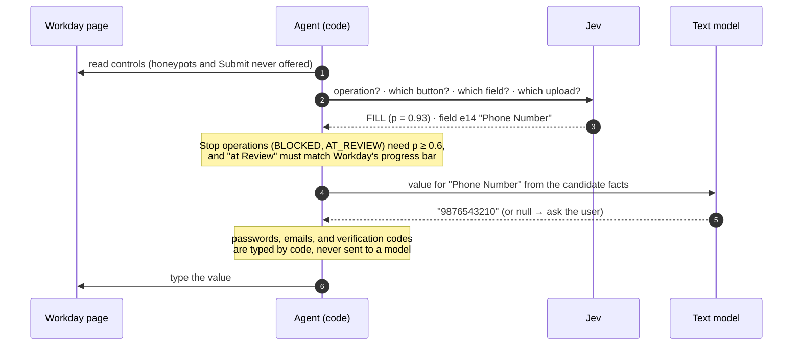
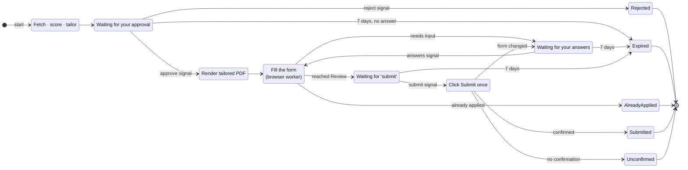
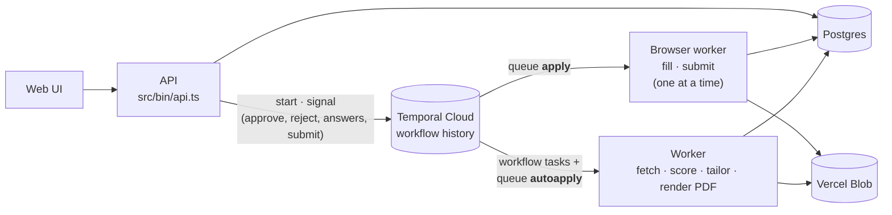

# AutoApply

Tailor your resume to a Workday job, review every change on the resume itself, and let a
browser agent fill in the application. Nothing is submitted until you say so.

- **Match**: reads the job from Workday, extracts its requirements, and scores your resume
  against each one (fit and keyword coverage).
- **Tailor**: rewrites existing resume lines to lead with what the job cares about. Code-level
  rules and model checks reject anything invented, dropped, or exaggerated.
- **Review**: the exact page that will be uploaded, with every change marked and explained.
- **Apply**: a browser agent signs in, fills each page, and uploads the tailored PDF. Questions
  it can't answer from your profile are asked once and remembered.
- **Submit**: only on your command, exactly once, confirmed by Workday.

## How it works

```
 Web UI / HTTP API ──► Temporal workflow (one per application)
                         │
                         ├─ worker (queue "autoapply")
                         │    fetch job ─► extract requirements ─► score ─► tailor ─► render PDF
                         │
                         └─ apply worker (queue "apply", Chromium)
                              fill the form ─► [ask the user] ─► stop at Review ─► submit once

 Postgres: resumes, applications, profile      Files: uploaded resumes, PDFs, screenshots
```

An application moves through `FETCHING → SCORING → TAILORING → AWAITING_APPROVAL →
QUEUED → APPLYING → (NEEDS_INPUT) → READY_TO_SUBMIT → SUBMITTING → SUBMITTED`.
See [docs/architecture.md](docs/architecture.md).

## How Jev is used

[Jev](https://docs.typesafe.ai) (TypeSafe AI) answers **typed questions about a given state**:
a choice among options, a score on a scale, or a yes/no, each with a calibrated probability.
AutoApply uses it wherever a decision has to be *checked* rather than *written*: how well a resume
fits, whether a rewrite is still true, and what to do next on a form. Free-form text (reading PDFs,
rewriting lines) goes to general models instead.

Every Jev answer passes through a gate in code before it has an effect. A low probability never
stops work, commits an answer, or keeps a rewrite.

```mermaid
flowchart LR
    subgraph match["1 · Match"]
        R["Resume + job requirements"] --> S{{"Jev · score 0–2<br/>per requirement"}}
        S --> F["Fit 0–100<br/>(must-haves count double)"]
    end

    subgraph tailor["2 · Tailor"]
        W["Rewrite model<br/>proposes new lines"] --> C["Code rules<br/>(no new numbers or tech,<br/>nothing dropped)"]
        C --> V{{"Jev · yes/no × 2 per line<br/>adds anything? · keeps everything?"}}
        V -->|"P ≥ 0.75 and P ≥ 0.6"| K["Rewrite kept"]
        V -->|"below"| X["Rewrite discarded"]
    end

    subgraph apply["3 · Fill the form"]
        P["Page snapshot<br/>(numbered controls)"] --> D{{"Jev · one request:<br/>operation + a target<br/>for each operation"}}
        D --> G["Confidence gate<br/>+ safety guards"]
        G --> A["Click · type · upload"]
        A --> P
        G -.->|"choosing an answer"| O{{"Jev · yes/no<br/>do the facts support it?"}}
        O -->|"P ≥ 0.7"| A
        O -->|"below"| U["Ask the user"]
    end

    F --> W
    K --> P
```



### One step of the form agent

The agent asks Jev *what to do* and *which element to do it to* in a **single request**. Jev
answers each question independently, so the request includes a target question for every
possible operation ("speculative fan-out"), and code uses only the one that matches. That is one
round trip per step instead of two. The pattern is adapted from
[browser-use/jev-ultrafast](https://github.com/browser-use/jev-ultrafast).



### Questions, thresholds, and why

| Where | Question type | What Jev decides | Gate in code |
| --- | --- | --- | --- |
| [Scoring](src/matching/scoring.ts#L23) | Score (0 / 1 / 2) per requirement | Not shown, related, or clearly shown | Fit is a weighted average ([`SCORING`](src/config.ts#L24)); each score keeps Jev's confidence |
| [Tailoring](src/tailoring/verify.ts#L46) | Yes/no, two per rewritten line | Does it add work the original doesn't state? Does it keep everything the original says? | Kept only if P ≥ 0.75 and P ≥ 0.6 ([`TAILORING`](src/config.ts#L32)), after the code rules |
| [Next action](src/apply/decide.ts#L83) | Choice: operation, plus one target per operation | Click, type, upload, wait, blocked, or at Review | Stopping needs P ≥ 0.6 ([`gate`](src/apply/decide.ts#L179)); otherwise the likeliest operation that keeps going |
| [Answer check](src/apply/decide.ts#L193) | Yes/no | Do the candidate's facts support this option? | Clicked only if P ≥ 0.7; the user's saved answers come first; otherwise the user is asked |

What keeps it accurate:

- **Small, focused state.** Each call gets only what the question is about. The answer check
  sees the candidate's answers and employers, not their whole resume.
- **Concrete criteria.** Every option says what it means, with an example of a wrong answer
  (e.g. "'Owned' → 'Implemented' weakens ownership").
- **Probabilities, not labels.** Thresholds are tuned per question, and uncertainty always
  falls back to the safe side: keep going, keep the original line, or ask the user.

## How Temporal is used

An application takes days, not seconds. It waits for you to approve the changes, maybe to answer a
question the form asked, and finally to say "submit". In between, a browser fills forms on another
machine, models time out, and processes restart on every deploy. [Temporal](https://temporal.io)
keeps each application's progress **durably**: the workflow picks up where it stopped, and never
repeats a step that must happen once.

Each application is one workflow, [`applicationWorkflow`](src/workflows/application.ts#L49), with
the ID `application-<id>`, so starting the same application twice is refused. The workflow only
decides the order of steps; every side effect (models, browser, database, files) is an
**activity**. That's what lets Temporal replay the workflow safely after a crash.



### Processes and task queues

The browser work runs on its own task queue, so it can live where Chromium can (and scale on its
own), while scoring and tailoring stay light. On a single small machine both run in one process
([`src/bin/workers.ts`](src/bin/workers.ts)).



The API never does slow work. It records your decision in the database, so the UI shows it at
once, and signals the workflow; the workflow moves on from there.

### Activities and retries

| Activities | Queue | Timeout | Retries | Why |
| --- | --- | --- | --- | --- |
| Fetch the job, score, tailor, render the PDF ([`work`](src/workflows/application.ts#L29)) | `autoapply` | 5 min | 3 attempts | Model and network calls fail now and then; running them again is harmless |
| Fill the application ([`browser`](src/workflows/application.ts#L36)) | `apply` | 30 min | 2 attempts | Filling never submits, and Workday keeps the draft, so a second run continues it |
| Click Submit ([`submitter`](src/workflows/application.ts#L43)) | `apply` | 30 min | **1 attempt** | Submitting must happen at most once. The attempt is also recorded before the click, and checked first |

Waiting costs nothing. `condition(..., "7 days")` is a durable timer, not a sleeping process, so
an application can wait a week for you with no worker running. When Workday emails a verification
code, the fill activity [heartbeats](src/apply/activities.ts#L118) while the browser waits on that
page for you to type the code in the app.

### Tested without a server

[`tests/workflow.test.ts`](tests/workflow.test.ts) runs the real workflow on Temporal's
**time-skipping** test server, with the activities faked. A 7-day wait passes in milliseconds, so
every path is covered: approve, reject, answer, expire, submit, submit unconfirmed, and already
applied.

## Tech stack

| Concern | Choice |
| --- | --- |
| Language | TypeScript on Node.js 22.18+ (run by Node directly; `tsx` for tools and tests) |
| Workflows and queues | [Temporal](https://temporal.io) |
| HTTP API | [Hono](https://hono.dev) |
| Models | [Vercel AI SDK](https://ai-sdk.dev) via the Vercel AI Gateway: Gemini (parsing), GPT-5 mini (rewriting), [Jev](https://docs.typesafe.ai) (scores and decisions) |
| Browser automation | [Playwright](https://playwright.dev) (Chromium) |
| Storage | PostgreSQL (`pg`, versioned migrations); files on Vercel Blob or local disk |
| Validation | [Zod](https://zod.dev) |
| UI | React, Vite, Tailwind CSS |
| Tooling | Vitest (with PGlite: Postgres in-process), Biome |

## Getting started

Requirements: Node.js 22.18+, Docker (for Postgres), the [Temporal CLI](https://docs.temporal.io/cli), and a
[Vercel AI Gateway](https://vercel.com/ai-gateway) key.

```bash
npm install
npx playwright install chromium
cp .env.example .env            # fill in AI_GATEWAY_API_KEY
npm run web:build
```

Start Postgres (host port 5433; migrations run automatically on startup):

```bash
npm run db
```

Then run the four processes, each in its own terminal:

```bash
npm run temporal       # local Temporal (UI at http://localhost:8233); skip when using Temporal Cloud
npm run worker         # fetch, score, tailor, render
npm run apply-worker   # browser agent
npm run api            # API + UI at http://localhost:3000
```

Or run everything with Docker: `docker compose up -d --build` with Temporal Cloud settings in `.env`,
or add `--profile local-temporal` for a local Temporal server.

## Configuration

All settings are environment variables; see [`.env.example`](.env.example).

| Variable | Purpose |
| --- | --- |
| `AI_GATEWAY_API_KEY` | Vercel AI Gateway key, used for every model |
| `AI_MODEL`, `REWRITE_MODEL`, `JEV_MODEL` | Model IDs for parsing, rewriting, and decisions |
| `GOOGLE_CLIENT_ID` | "Sign in with Google" (empty: local development, one local user) |
| `SESSION_SECRET` | Signs session cookies |
| `CREDENTIALS_KEY` | Encrypts users' Workday passwords (never change it once set) |
| `WORKDAY_EMAIL`, `WORKDAY_PASSWORD` | Workday account for the developer tools; the app uses each user's own |
| `DATABASE_URL` | Postgres connection (default matches `npm run db`) |
| `DATABASE_CA_CERT` | CA certificate for a Postgres server with its own CA (e.g. Aiven) |
| `DATABASE_SCHEMA` | Postgres schema for the tables, when the database is shared with other apps |
| `BLOB_READ_WRITE_TOKEN` | Vercel Blob private store for files; without it, files go to `DATA_DIR` |
| `DATA_DIR` | Local file storage when no Blob token is set (default `./data`) |
| `TEMPORAL_ADDRESS`, `TEMPORAL_NAMESPACE`, `TEMPORAL_API_KEY` | Temporal Cloud connection (empty = local dev server); mTLS via `TEMPORAL_TLS_CLIENT_*` |
| `PORT` | Web port (default 3000) |
| `BROWSER_CDP_URL` | Use a remote browser instead of launching Chromium |

Scoring and tailoring thresholds live in [`src/config.ts`](src/config.ts).

## Project structure

```
src/
  bin/          process entry points: api, worker, apply-worker
  config.ts     environment and tuning thresholds
  schemas/      Zod schemas for every shared type
  lib/          reusable helpers (HTML to text, names and phones, company matching, words)
  ai/           model selection
  workday/      Workday posting URLs and the public jobs API
  resume/       parsing, plain-text form, page template, PDF rendering, editable lines
  matching/     requirement extraction, scoring, keyword coverage
  tailoring/    rewrite loop, prompts, proposal and repair, verification, rules
  apply/        form-filling agent, safety guards, submit, browser activities
  store/        Postgres store, connection, and migrations
  files/        file storage: Vercel Blob, local disk, or memory (tests)
  workflows/    Temporal workflow, activities, queues, client
  server/       HTTP API
web/            React UI
tools/          developer CLIs (npm run tool:*)
tests/          Vitest suites
docs/           architecture and deployment guides
```

## Development

```bash
npm run check        # lint, type-check, and test
npm test             # tests only (Postgres runs in-process via PGlite; no server needed)
npm run format       # format and apply safe lint fixes
npm run web:dev      # UI with hot reload (proxies /api to :3000)
```

Developer tools for working on one stage at a time:

| Command | What it does |
| --- | --- |
| `npm run tool:fetch-job -- <url>` | Print a Workday job posting |
| `npm run tool:parse-resume -- <pdf>` | Parse a resume PDF to JSON |
| `npm run tool:score -- <url> <resume.json>` | Score a resume against a job |
| `npm run tool:tailor -- <score.json>` | Tailor and print the changes |
| `npm run tool:fill -- <url>` | Run the form agent up to Review (never submits) |
| `npm run tool:inspect-page -- <url>` | Show what the agent sees on a page |
| `npm run tool:record-form -- <url>` | Record the fields on each page of an application |
| `npm run tool:check-models` | Check that every configured model answers |

## Safety guarantees

Enforced in code, independent of any model:

- The agent can never click Submit; only `src/apply/submit.ts` can, once, after your command.
  The attempt is recorded before the click and never retried.
- Honeypot fields are never shown to the model or filled.
- Your password is typed by code and never sent to a model.
- Rewrites can't add numbers or technologies absent from your resume, or drop numbers,
  tools, or ownership verbs from the original line.
- Answers come from your resume and profile. Anything else is asked, never guessed.

## Deployment

See [docs/deployment.md](docs/deployment.md).

## Limitations

- Workday only. Other applicant tracking systems need their own sign-in and review handling.
- One Workday login per user, used for every company (Workday keeps a separate account per company).
- Google and LinkedIn sign-in can't be automated; use a Workday email and password account.
